# Лабораторная работа №5: Запуск сайта в контейнере

---

## Студент

- **Имя и фамилия**: Никита Савка  
- **Группа**: I2302  
- **Платформа**: macOS (Apple M3)  
- **Дата выполнения**: 5 марта 2025  

---

## Цель работы

Создать **Docker-образ** с **Apache HTTP Server**, **PHP (mod_php)** и **MariaDB**, развернуть сайт на базе **WordPress** с сохранением базы данных в монтируемом томе `/var/lib/mysql` и доступом через порт **8000**. Проверить работоспособность WordPress.

---

## Задачи

1. Подготовить репозиторий `containers05`.  
2. Создать базовый `Dockerfile` с Apache, PHP и MariaDB.  
3. Извлечь и настроить конфигурационные файлы (`apache2.conf`, `000-default.conf`, `php.ini`, `50-server.cnf`).  
4. Настроить **Supervisor** для управления сервисами.  
5. Подключить том для хранения базы данных.  
6. Установить и протестировать WordPress.  

---

## Ход выполнения

### 1. Подготовка окружения

#### Шаги:  
1. **Создание репозитория**:  
   - Создал публичный репозиторий `containers05` на GitHub: [https://github.com/NikitaBytes/containers05](https://github.com/NikitaBytes/containers05).  
   - **Скриншот**: Создание репозитория  
     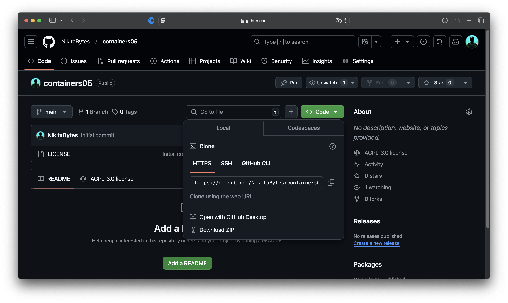  

2. **Клонирование**:  
   - Выполнил:  
     ```bash
     cd ~/Projects
     git clone https://github.com/NikitaBytes/containers05.git
     cd containers05
     ```  
   - **Скриншот**: Клонирование  
     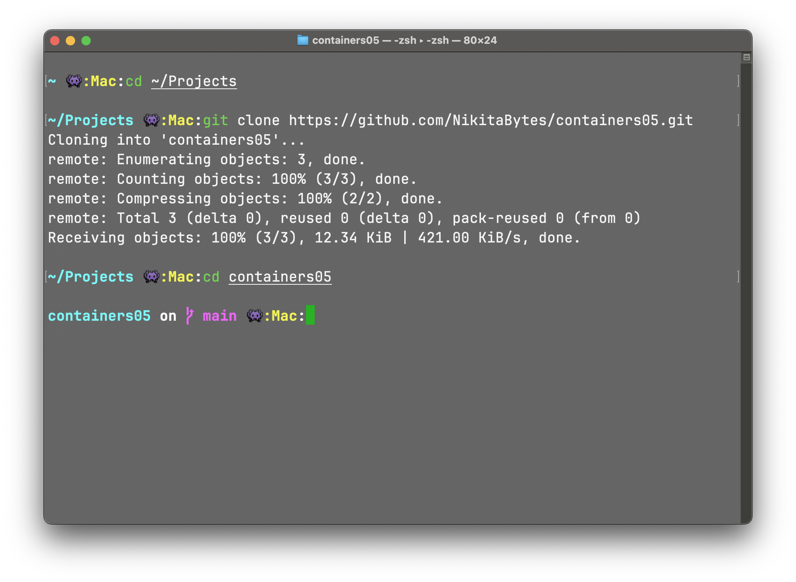  

#### Итог:  
Рабочая директория готова.  

---

### 2. Базовый Dockerfile

#### 2.1 Создание файла Dockerfile

#### Шаги:  
- **Шаг 1: Создание файла**  
  - В корне проекта создал файл `Dockerfile`:  
    ```bash
    touch Dockerfile
    ```  
  - **Разбор**:  
    - Команда `touch` создаёт пустой файл `Dockerfile`, который станет основой для инструкций сборки образа.  

- **Шаг 2: Редактирование Dockerfile**  
  - Открыл файл в редакторе (например, `nano`) и добавил:  
    ```dockerfile
    FROM debian:latest

    RUN apt-get update && \
        apt-get install -y apache2 php libapache2-mod-php php-mysql mariadb-server && \
        apt-get clean
    ```  
  - **Разбор инструкций**:  
    - **`FROM debian:latest`**  
      - Указывает базовый образ — последнюю версию Debian, с которой начинается сборка.  
    - **`RUN apt-get update && \`**  
      - Обновляет список пакетов для доступа к актуальным версиям ПО.  
    - **`apt-get install -y apache2 php libapache2-mod-php php-mysql mariadb-server && \`**  
      - Устанавливает ключевые компоненты:  
        - `apache2` — веб-сервер для обработки HTTP-запросов.  
        - `php` — интерпретатор языка PHP.  
        - `libapache2-mod-php` — модуль для интеграции PHP с Apache.  
        - `php-mysql` — расширение для работы с MySQL/MariaDB.  
        - `mariadb-server` — сервер базы данных MariaDB.  
      - Флаг `-y` автоматически соглашается с установкой.  
    - **`apt-get clean`**  
      - Удаляет временные файлы установки, оптимизируя размер образа.  

- **Скриншот**: Содержимое файла  
  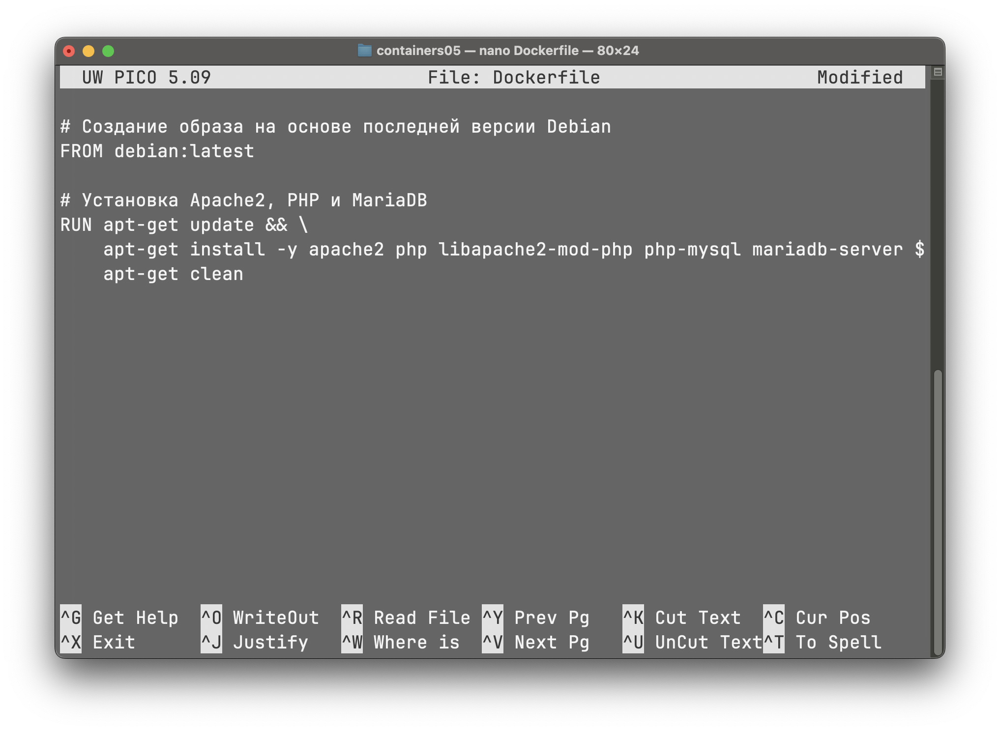  

#### Итог:  
Файл `Dockerfile` готов для создания базового образа с необходимыми сервисами.  

---

### 2.2 Сборка образа

#### Шаги:  
- **Команда**:  
  ```bash
  docker build -t apache2-php-mariadb .
  ```  
- **Разбор**:  
  - `docker build` — запускает процесс сборки образа на основе `Dockerfile`.  
  - `-t apache2-php-mariadb` — присваивает образу имя (тег) `apache2-php-mariadb`.  
  - `.` — указывает текущую директорию как контекст сборки (все файлы доступны для использования).  

- **Скриншот**: Процесс сборки  
  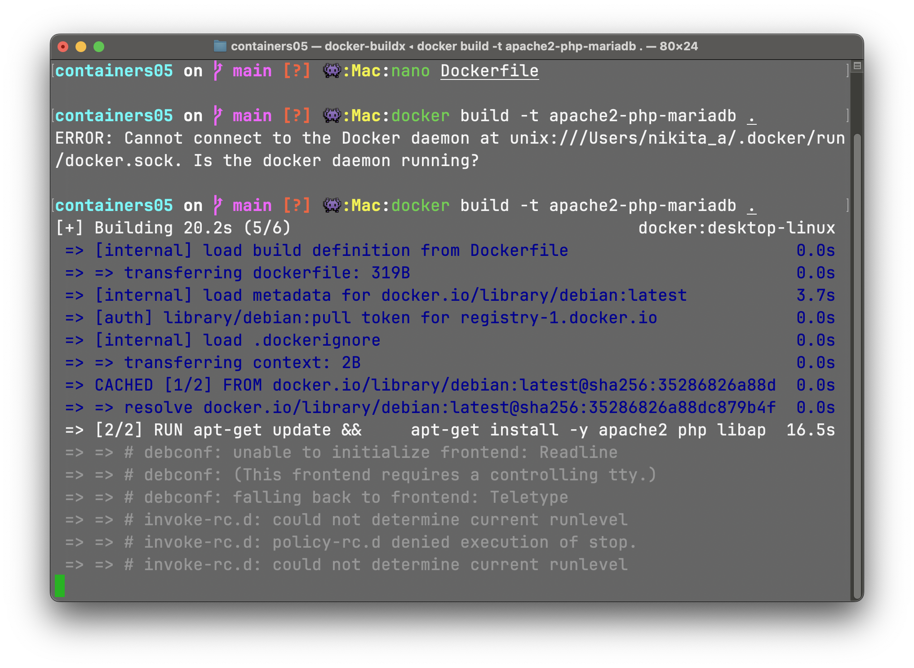  

#### Итог:  
Образ `apache2-php-mariadb` успешно собран и готов к запуску.  

---

### 2.3 Запуск контейнера

#### Шаги:  
- **Команда**:  
  ```bash
  docker run -d --name apache2-php-mariadb apache2-php-mariadb bash
  ```  
- **Разбор**:  
  - `docker run` — создаёт и запускает контейнер из указанного образа.  
  - `-d` — запускает контейнер в фоновом режиме (detached).  
  - `--name apache2-php-mariadb` — задаёт имя контейнера для удобного управления.  
  - `apache2-php-mariadb` — имя собранного образа.  
  - `bash` — команда, выполняемая при старте (запускает оболочку Bash для дальнейшей работы).   

#### Итог:  
Контейнер запущен в фоновом режиме, готов для извлечения конфигураций или тестирования.  

---

### 3. Извлечение конфигураций

#### Шаги:  
1. **Создание структуры**:  
   ```bash
   mkdir -p files/apache2 files/php files/mariadb
   ```   

2. **Копирование файлов**:  
   ```bash
   docker cp apache2-php-mariadb:/etc/apache2/sites-available/000-default.conf files/apache2/
   docker cp apache2-php-mariadb:/etc/apache2/apache2.conf files/apache2/
   docker cp apache2-php-mariadb:/etc/php/8.2/apache2/php.ini files/php/
   docker cp apache2-php-mariadb:/etc/mysql/mariadb.conf.d/50-server.cnf files/mariadb/
   ```  
   - **Скриншот**: Копирование  
     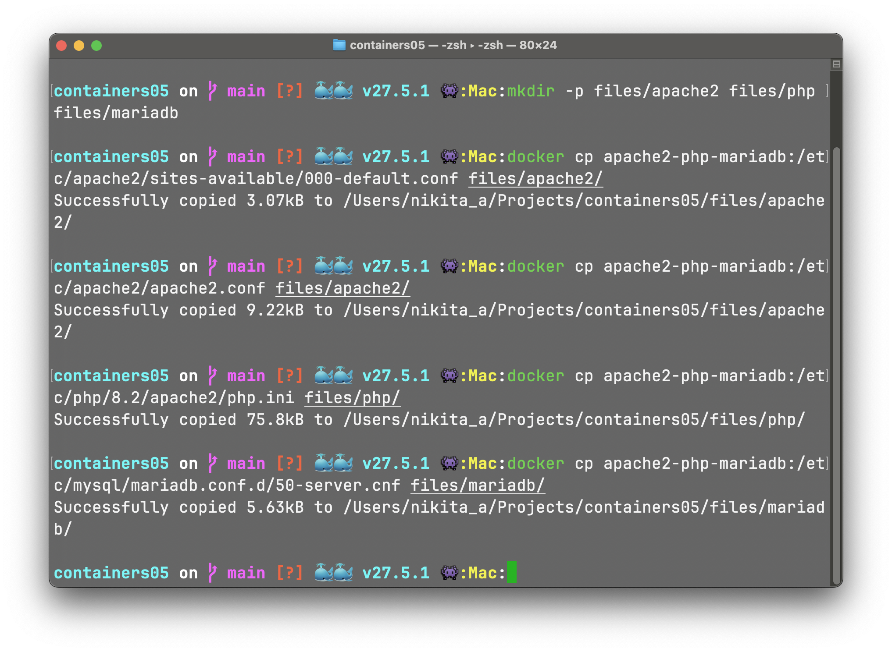  

3. **Проверка**:  
   ```bash
   ls -l files/apache2/ files/php/ files/mariadb/
   ```  
   - **Скриншот**: Проверка  
     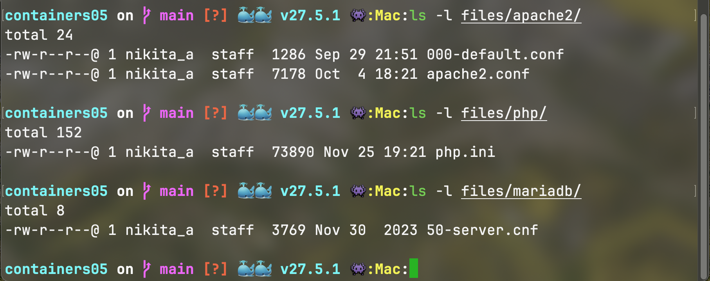

4. **Очистка**:  
   ```bash
   docker stop apache2-php-mariadb
   docker rm apache2-php-mariadb
   ```  
   - **Скриншот**: Удаление  
     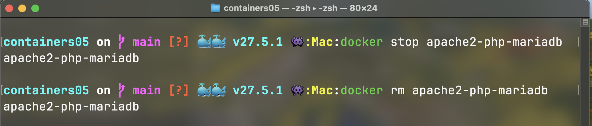  

#### Итог:  
Конфигурации готовы к настройке.  

---

### 4. Настройка конфигураций

#### 4.1 Apache  
- **`files/apache2/000-default.conf`**:  
  - `#ServerName www.example.com` → `ServerName localhost`. 

  - `ServerAdmin webmaster@localhost` → мой email.  
  - Добавил:  
    ```
    DirectoryIndex index.php index.html
    ```  
- **`files/apache2/apache2.conf`**:  
  - В конец:  
    ```
    ServerName localhost
    ```  

   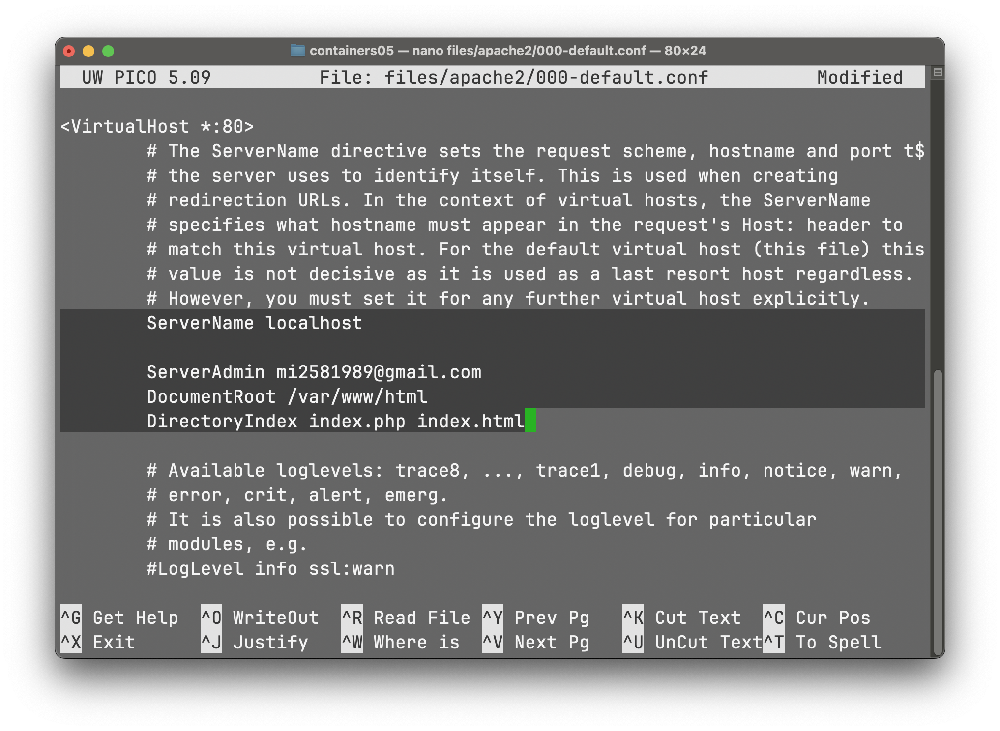 

#### 4.2 PHP  
- **`files/php/php.ini`**:  
  - `;error_log = php_errors.log` → `error_log = /var/log/php_errors.log`.  
  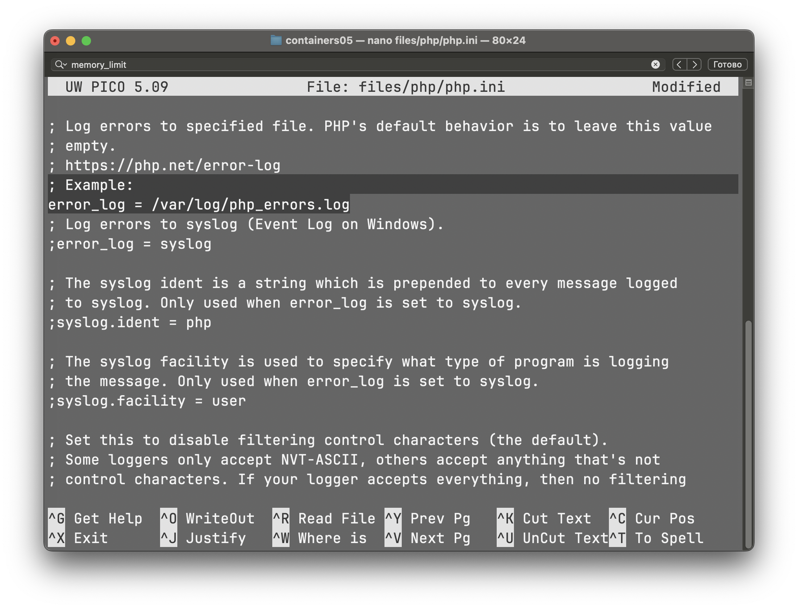

  - Настройки:  
    ```
    memory_limit = 128M
    upload_max_filesize = 128M
    post_max_size = 128M
    max_execution_time = 120
    ```  
   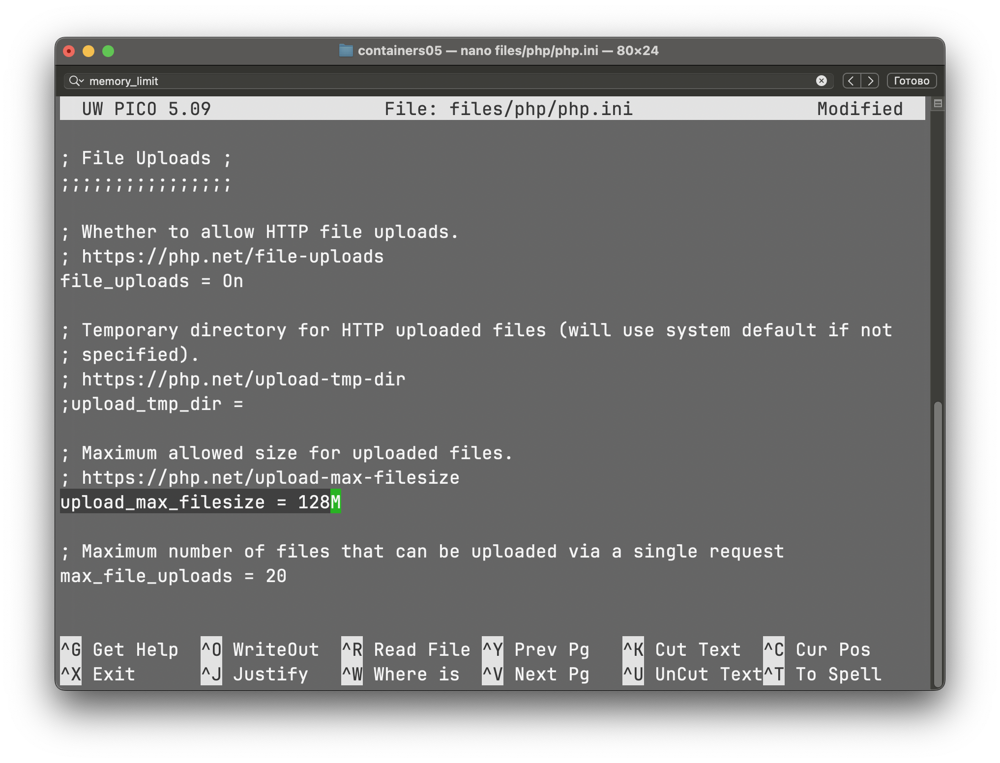
   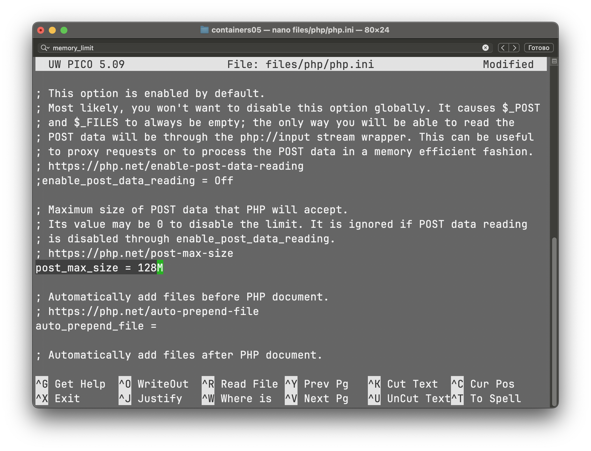

#### 4.3 MariaDB  
- **`files/mariadb/50-server.cnf`**:  
  - Раскомментировал:  
    ```
    log_error = /var/log/mysql/error.log
    ```  
   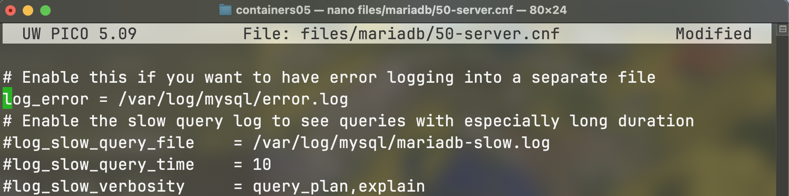
#### Итог:  
Конфигураций сохранены и адаптированы для работы.  

---

### 5. Настройка Supervisor

#### Шаги:  
1. **Создание структуры**:  
   ```bash
   mkdir -p files/supervisor
   ```  

2. **Файл `supervisord.conf`**:  
   ```ini
   [supervisord]
   nodaemon=true
   logfile=/dev/null
   user=root

   [program:apache2]
   command=/usr/sbin/apache2ctl -D FOREGROUND
   autostart=true
   autorestart=true
   startretries=3
   stderr_logfile=/proc/self/fd/2
   user=root

   [program:mariadb]
   command=/usr/sbin/mariadbd --user=mysql
   autostart=true
   autorestart=true
   startretries=3
   stderr_logfile=/proc/self/fd/2
   user=mysql
   ```  
   - **Скриншот**: Содержимое  
     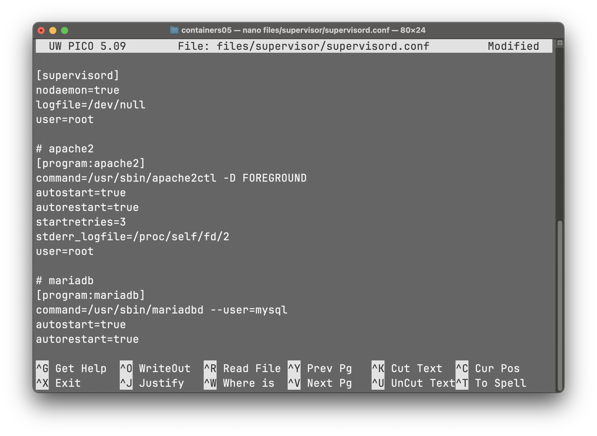  

#### Итог:  
Supervisor готов управлять сервисами.  

---

### 6. Финальный `Dockerfile`

#### Код:  
```dockerfile
FROM debian:latest

# Установка пакетов
RUN apt-get update && \
    apt-get install -y apache2 php libapache2-mod-php php-mysql mariadb-server supervisor && \
    apt-get clean

# Монтируемые тома
VOLUME /var/lib/mysql
VOLUME /var/log

# Добавление WordPress
ADD https://wordpress.org/latest.tar.gz /var/www/html/

# Копирование конфигураций
COPY files/apache2/000-default.conf /etc/apache2/sites-available/000-default.conf
COPY files/apache2/apache2.conf /etc/apache2/apache2.conf
COPY files/php/php.ini /etc/php/8.2/apache2/php.ini
COPY files/mariadb/50-server.cnf /etc/mysql/mariadb.conf.d/50-server.cnf
COPY files/supervisor/supervisord.conf /etc/supervisor/supervisord.conf

# Создание сокета MariaDB
RUN mkdir /var/run/mysqld && chown mysql:mysql /var/run/mysqld

# Открытие порта
EXPOSE 80

# Запуск Supervisor
CMD ["/usr/bin/supervisord", "-n", "-c", "/etc/supervisor/supervisord.conf"]
```

#### Итог:  
`Dockerfile` готов для финальной сборки.  

---

### 7. Сборка и запуск

#### Шаги:  
1. **Сборка**:  
   ```bash
   docker build -t apache2-php-mariadb .
   ```  
   - **Скриншот**: Сборка  
     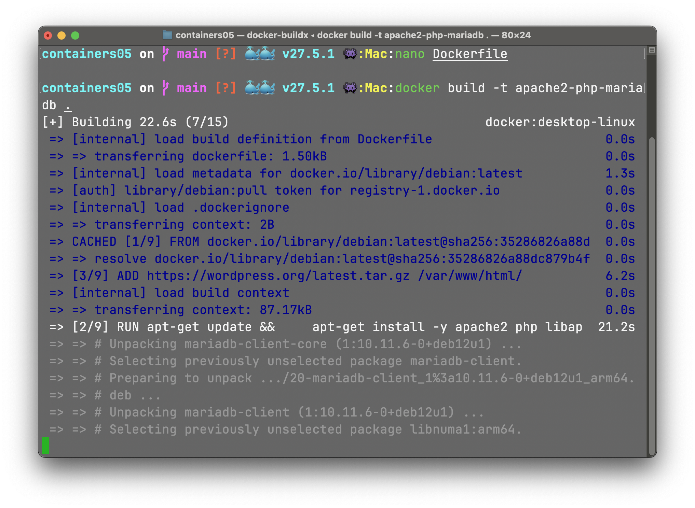  

2. **Запуск**:  
   ```bash
   docker run -d -p 8000:80 --name apache2-php-mariadb -v mariadb_data:/var/lib/mysql apache2-php-mariadb
   ```  
   - **Скриншот**: Запуск  
     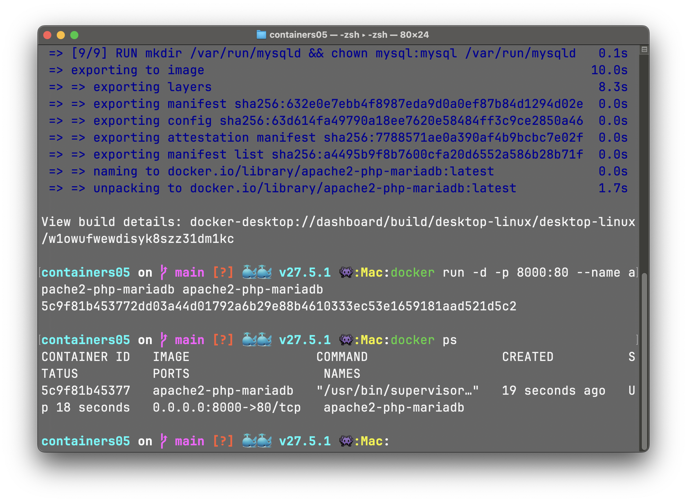  

3. **Проверка**:  
   ```bash
   docker ps
   docker exec -it apache2-php-mariadb ls /var/www/html
   ```  

#### Итог:  
Контейнер работает, том подключён.  

---

### 8. Настройка базы данных

#### Шаги:  
1. **Подключение**:  
   ```bash
   docker exec -it apache2-php-mariadb mysql -u root
   ```  

2. **Создание БД**:  
   ```sql
   CREATE DATABASE wordpress;
   CREATE USER 'wordpress'@'localhost' IDENTIFIED BY 'wordpress';
   GRANT ALL PRIVILEGES ON wordpress.* TO 'wordpress'@'localhost';
   FLUSH PRIVILEGES;
   EXIT;
   ```  
   - **Скриншот**: Создание БД  
     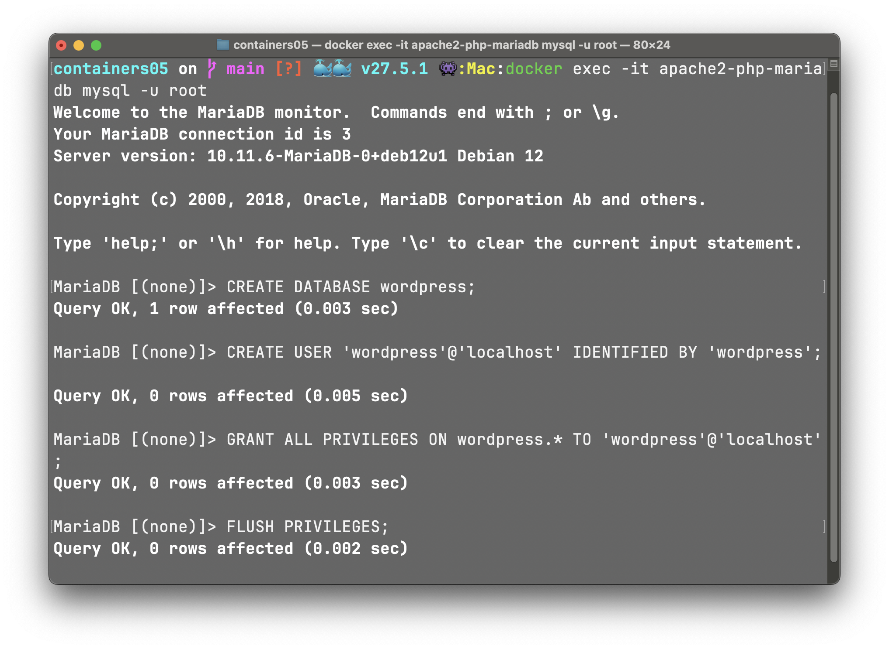  

3. **Перезапуск**:  
   ```bash
   docker restart apache2-php-mariadb
   ```  

#### Итог:  
База данных готова для WordPress.  

---

### 9. Развёртывание WordPress

#### Шаги:  
1. **Разархивирование**:  
   ```bash
   docker exec -it apache2-php-mariadb bash -c "tar -xzf /var/www/html/latest.tar.gz -C /var/www/html/ --strip-components=1"
   docker exec -it apache2-php-mariadb rm /var/www/html/index.html
   ```  
   - **Скриншот**: Разархивирование  
     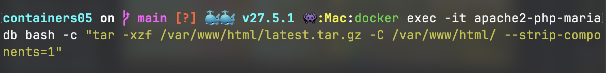  

2. **Проверка**:  
   ```bash
   docker exec -it apache2-php-mariadb ls -l /var/www/html
   ```  

#### Итог:  
WordPress доступен по `http://localhost:8000`.  

---

### 10. Настройка `wp-config.php`

#### Шаги:  
1. **Установка через браузер**:  
   - Открыл `http://localhost:8000`, ввёл:  
     - БД: `wordpress`  
     - Пользователь: `wordpress`  
     - Пароль: `wordpress`  
     - Хост: `localhost`  

2. **Ручное создание**:  
   - Добавил `files/wp-config.php` и обновил `Dockerfile`:  
     ```dockerfile
     COPY files/wp-config.php /var/www/html/wp-config.php
     ```  

3. **Права**:  
   ```bash
   docker exec -it apache2-php-mariadb chown www-data:www-data /var/www/html/wp-config.php
   docker exec -it apache2-php-mariadb chmod 644 /var/www/html/wp-config.php
   ```  

#### Итог:  
WordPress подключён к базе данных.  

---

### 11. Завершение установки

#### Шаги:  
1. **Форма установки**:  
   - Заполнил данные на `http://localhost:8000`.  
   - **Скриншот**: Установка  
     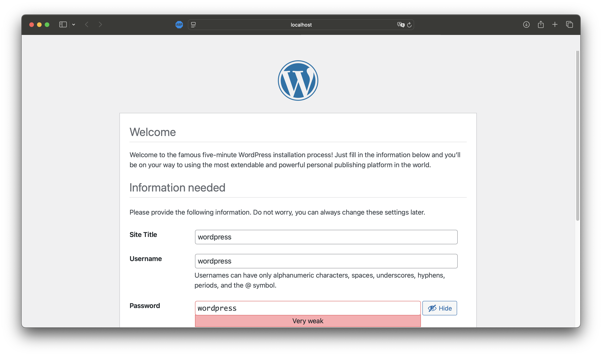  

2. **Админ-панель**:  
   - Вошёл в `http://localhost:8000/wp-admin`.  
   - **Скриншот**: Админка  
     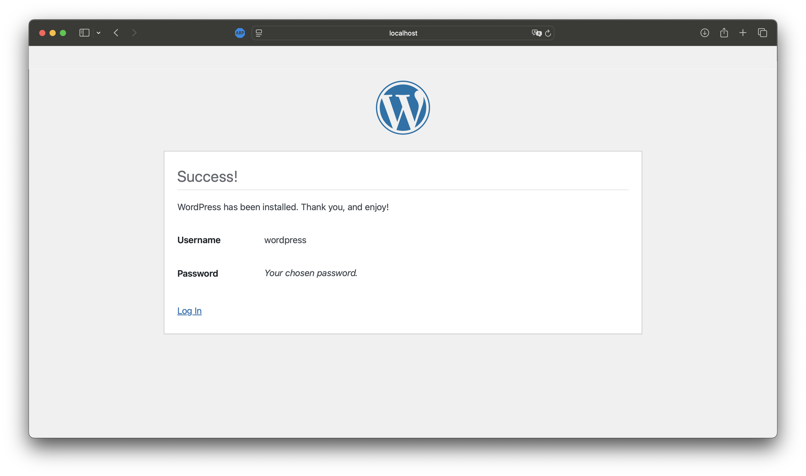  
     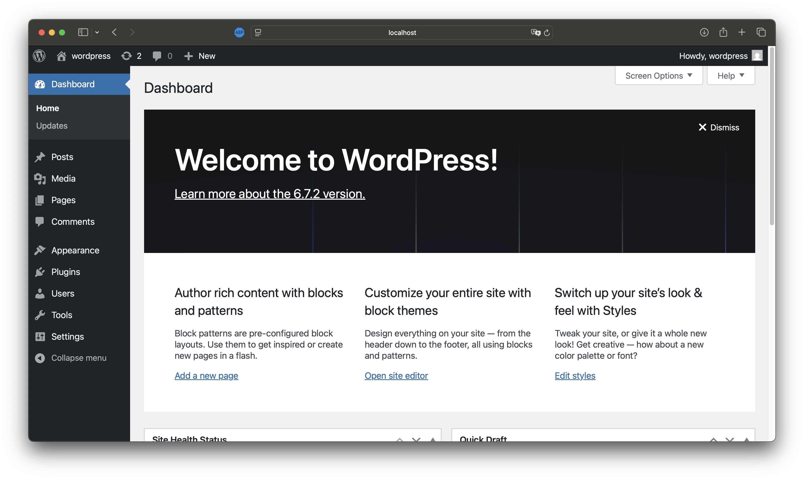 

#### Итог:  
Сайт полностью работоспособен.  

---

## Ответы на вопросы

1. **Какие файлы изменены?**  
   - `000-default.conf`, `apache2.conf`, `php.ini`, `50-server.cnf`.  

2. **За что отвечает `DirectoryIndex`?**  
   - Указывает приоритет файлов для главной страницы (например, `index.php`).  

3. **Зачем нужен `wp-config.php`?**  
   - Хранит настройки БД и безопасности WordPress.  

4. **Что такое `post_max_size`?**  
   - Максимальный размер данных POST, влияет на загрузку файлов.  

5. **Недостатки образа?**  
   - Один контейнер для всех сервисов.  
   - Ручная настройка БД.  
   - Нет SSL и обновлений WordPress.  

---

## Выводы

В ходе выполнения лабораторной работы №5 мной был создан Docker-образ, объединяющий в себе веб-сервер Apache HTTP Server, интерпретатор PHP с модулем mod_php и сервер базы данных MariaDB. Сайт на базе WordPress успешно развёрнут и работает на порту 8000, а данные базы данных сохраняются в монтируемом томе, что гарантирует их сохранность между пересозданиями контейнера.

**Ключевые моменты работы:**
- **Подготовка окружения и репозитория:** Создание публичного репозитория `containers05` на GitHub, его клонирование и настройка рабочей директории позволили организовать процесс работы и документирования всех этапов.
- **Создание и сборка Dockerfile:** Базовый `Dockerfile` был создан с помощью команд `touch` и редактирования в `nano`. В нем последовательно устанавливались Apache, PHP и MariaDB, что позволило получить рабочий образ. Команда `docker build -t apache2-php-mariadb .` успешно собрала образ, который стал основой для дальнейших шагов.
- **Извлечение и настройка конфигураций:** Из контейнера были извлечены файлы конфигурации для Apache, PHP и MariaDB. Эти файлы были настроены с учётом требований (например, изменена директива `DirectoryIndex`, добавлена настройка `ServerName`, изменены параметры памяти и загрузки в php.ini, раскомментирована строка логирования в MariaDB). Такой подход позволил адаптировать стандартные настройки под конкретные нужды развёртывания WordPress.
- **Использование Supervisor:** Для одновременного запуска Apache и MariaDB в одном контейнере был выбран Supervisor. Это решение обеспечивает автоматический перезапуск сервисов в случае их сбоя, позволяет централизованно управлять логированием и упрощает запуск нескольких процессов в контейнере, что особенно удобно при отсутствии отдельной системы инициализации в Docker.
- **Монтируемый том для базы данных:** Применение тома через флаг `-v mariadb_data:/var/lib/mysql` гарантирует, что данные базы сохраняются независимо от жизненного цикла контейнера, что является важным аспектом в реальных приложениях.
- **Развёртывание WordPress:** После сборки и запуска контейнера, WordPress был установлен и настроен, а также произведено создание базы данных и пользователя через MySQL. В итоге сайт доступен по адресу [http://localhost:8000](http://localhost:8000), что подтверждает корректность всех настроек.

**Преимущества и недостатки:**
- **Преимущества:**
  - Быстрое развёртывание полного стека (Apache, PHP, MariaDB) в одном Docker-образе.
  - Сохранение данных базы через монтируемый том.
  - Supervisor обеспечивает надёжный контроль над работой сервисов и автоматический перезапуск при сбоях.
  - Процесс сборки и настройки автоматизирован посредством Dockerfile, что упрощает развёртывание на других машинах.
  
- **Недостатки:**
  - Все сервисы работают в одном контейнере, что усложняет масштабирование и обновление. Для продакшена рекомендуется разделять их на отдельные контейнеры.
  - Настройка безопасности (например, SSL, сильные пароли) выполнена минимально, что требует доработки для реальных проектов.
  - Автоматизация создания базы данных и пользователя отсутствует – эти шаги выполняются вручную, что может быть улучшено посредством специальных init-скриптов.

**Общий итог:**
Лабораторная работа позволила освоить основные принципы контейнеризации с помощью Docker, научила создавать образы, извлекать и настраивать конфигурационные файлы, а также интегрировать несколько сервисов в одном контейнере с использованием Supervisor. Полученный опыт является ценным для дальнейшей работы с контейнеризацией веб-приложений, демонстрируя как быстро можно развернуть сложную серверную инфраструктуру с сохранением данных.

Данный подход, несмотря на некоторые ограничения в масштабируемости и безопасности, отлично подходит для разработки, тестирования и прототипирования веб-приложений. В дальнейшем можно оптимизировать образ для продакшена, разделив сервисы и внедрив дополнительные меры безопасности.

---

## Источники

1. [Документация Docker](https://docs.docker.com/)  
2. [Apache Docs](https://httpd.apache.org/docs/)  
3. [MariaDB KB](https://mariadb.com/kb/en/)  
4. [WordPress](https://wordpress.org/)  
5. [Supervisor Docs](http://supervisord.org/)  
